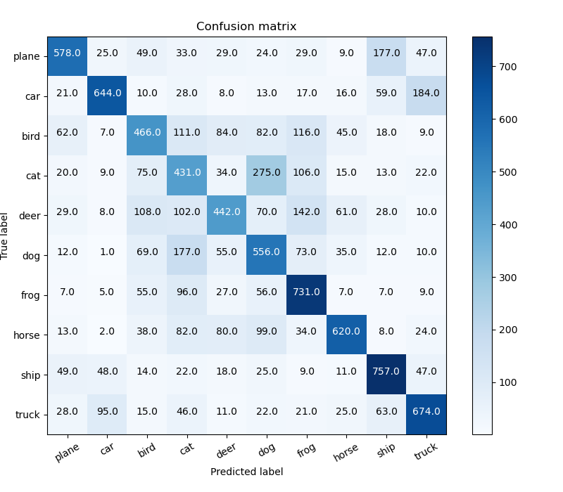
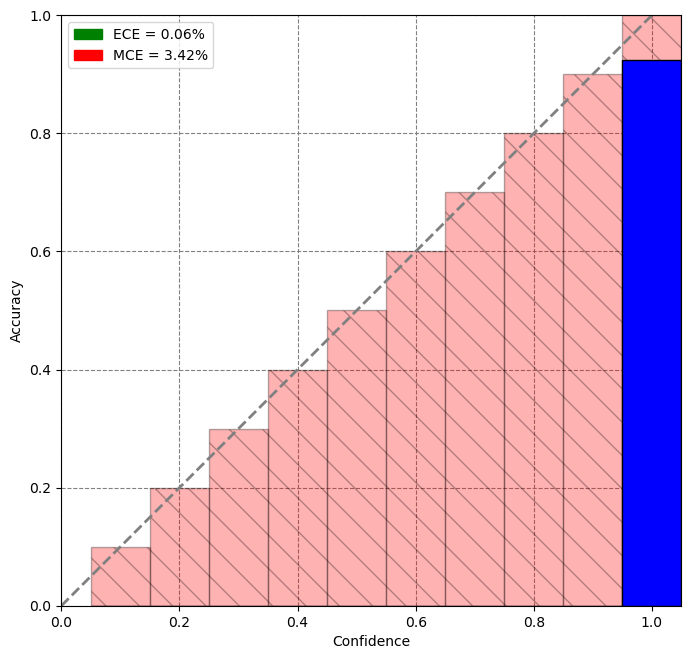

# Coding Challenge

The test.py file will perform the following operations
* Perform inference on a folder of example images
* Create and plot a confusion matrix
* Compute the Expected Calibration Error (ECE) and Max Calibration Error (MCE)
* Save false positives of each class in a subfolder of ‘results/false_positives’
* Generate the potential patterns figure of false positive
project
│   README.md
│   main.py    
│
└───data
│   │   data.csv
│   │   data.txt
│   │   ...
│   
└───models
│   │   model.py
│   │   ...
│   
└───utils
│   │   helper.py
│   │   ...

    .
    ├── ...
    ├── test                    # Test files (alternatively `spec` or `tests`)
    │   ├── benchmarks          # Load and stress tests
    │   ├── integration         # End-to-end, integration tests (alternatively `e2e`)
    │   └── unit                # Unit tests
    └── ...

## Usage of test.py file
$ python test.py --test_dir 'cifar10/test'

Arguments to perform the model performance evulation.
```
optional arguments:
  --model            which model to use ['tiny', 'small', 'medium', 'large']
  --checkpoint       the path to load saved model default="./results/checkpoints/epoch_3.pth"
  --run_train        train the model
  --train_epochs     number of epochs to train
```


## Example Confusion Matrix



## Example Calibration Graph



## Dependencies

The build-time and runtime dependencies of this repository are:

* [numpy](http://www.numpy.org/)
* [scikit-fmm](https://github.com/scikit-fmm)
* [scikit-image](https://github.com/scikit-image)
* [tqdm](https://github.com/noamraph/tqdm)
