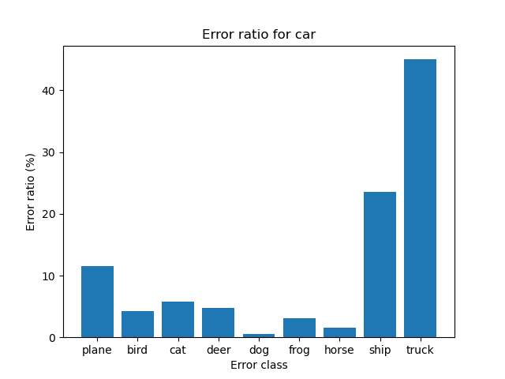

# Coding Challenge

The test.py file will perform the following operations
* Perform inference on a folder of example images
* Create and plot a confusion matrix
* Compute the Expected Calibration Error (ECE) and Max Calibration Error (MCE)
* Save false positives of each class in a subfolder of ‘results/false_positives’
* Generate the potential patterns figure of false positive
### Project Structure

    .
    ├── test.py                 #  Evaluate the performance (main file)
    ├── runner.py               #  Model related operation such as train, test, save, load the pretrained model.
    ├── models                  # 
    │   └── base_model.py       #  Build the Model Class
    ├── utils                   #  Useful functions
    │   ├── __init__.py         #  To mark directories on disk as Python package directories
    │   └── utils                 
    ├── results                 #  Store Experimental Result
    └── ...

## Usage of test.py file
$ python test.py --test_dir 'cifar10/test'

Arguments to perform the model performance evulation.
```
optional arguments:
  --test_dir         path to the test folder 
  --model            which model to use ['tiny', 'small', 'medium', 'large'] Different ConvNext Models
  --checkpoint       the path to load saved model default="./results/checkpoints/epoch_3.pth"
  --run_train        train the model
  --train_epochs     number of epochs to train
```


## Confusion Matrix on the Test Dataset of Cifar10


## Calibration Graph on the Test Dataset of Cifar10


## Error Distributions among Different Classess (Find Patterns)

The first pattern observed is that lots of false positive errors are caused by truck and car.
Based on this property, we should design our network with better feature representations of
vehicles.  Maybe enhancing the class weight for the car and truck improves the training reuslt.

Another plans includes the following steps 1 collect false positives 2 extract features (pretrain model, raw pixel,
edge detection) 2 determine the number of clusters (I set it to 10 which is equal to the number of classes)
3 use k-means to cluster the images 4 Apply K-Means clustering to group the images into clusters based on their extracted features.
5 use t-SNE to reduce the dimensionality of feature space and plot clustered image. 

## Limitation 
The functions save_false_positives and test_model should be merged together, so the inference is only required to 
be computed once, which improves the efficiency. Currently, only the operation of computing confusion matrix and 
operation of computing Expected Calibration Error (ECE) and Max Calibration Error (MCE).


## Dependencies

The build-time and runtime dependencies of this repository are:
* [pytorch](https://pytorch.org/)
* [numpy](http://www.numpy.org/)
* [scikit-learn](https://scikit-learn.org/stable/)
* [tqdm](https://github.com/noamraph/tqdm)
