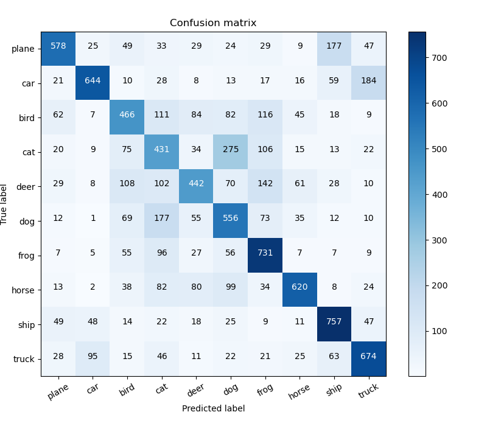

# coding_challenge

## Usage of test.py file
$ python test.py --test_dir 'cifar10/test'

The test.py file will perform the following operat
* Perform inference on a folder of example images
* Create and plot a confusion matrix
* Compute the Expected Calibration Error (ECE) and Max Calibration Error (MCE)
* Save false positives of each class in a subfolder of ‘results/false_positives’
* Generate the potential patterns figure of false positive

## Example Confusion Matrix

## Example Lung Airway Tracing

